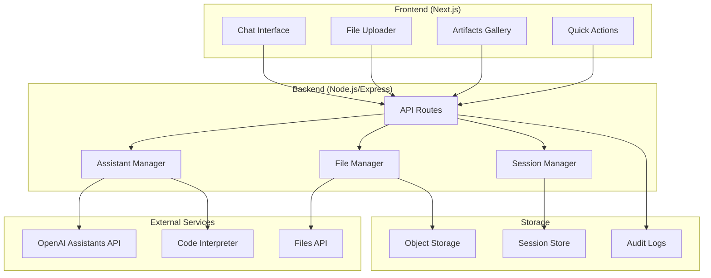

# Design Document

## Overview

The AI Data Analyst Demo is a full-stack web application that provides automated data analysis capabilities through OpenAI's Assistants API. The system consists of a Next.js frontend with chat interface and file upload capabilities, and a Node.js backend that orchestrates interactions with OpenAI's services including the Assistants API, Code Interpreter, and Files API.

The architecture follows a clean separation between presentation, business logic, and external service integration, with emphasis on real-time user feedback, artifact management, and graceful error handling.

## Architecture

### High-Level Architecture



### Component Architecture

**Frontend Components (MUI-based):**

- `AnalystMuiScaffold`: Main layout component with AppBar, Drawer, and responsive design
- `ChatPane`: Conversation UI with message history and input using MUI TextField and IconButton
- `FileUploader`: Drag-and-drop CSV upload with MUI components and validation
- `ArtifactsPanel`: Right drawer showing generated files with MUI List and download buttons
- `QuickActions`: Preset analysis buttons using MUI Button components with icons
- `ChatMessage`: Individual message display with MUI Box and Typography
- `ThemeToggle`: Dark/light mode toggle using MUI IconButton
- `InsightCard`: Structured display of analysis results using MUI Card components
- `ErrorBoundary`: Graceful error handling with MUI Alert and Snackbar components

**Backend Services (In-Memory MVP):**

- `AssistantService`: Manages OpenAI Assistant lifecycle and conversations
- `FileService`: Handles file upload, validation, and temporary storage
- `AnalysisService`: Orchestrates data analysis workflows
- `SessionStore`: In-memory session management with TTL cleanup
- `FileStore`: Temporary file storage in filesystem
- `PIIFilter`: Detects and flags PII columns in uploaded data
- `RunQueue`: Simple in-memory queue for managing concurrent analyses

## Components and Interfaces

### Frontend Interfaces

```typescript
// Core data types
interface AnalysisResult {
  id: string;
  type: 'profile' | 'trend' | 'top-sku' | 'channel-mix' | 'outlier';
  insight: string;
  chartUrl?: string;
  dataUrl?: string;
  timestamp: Date;
}

interface ChatMessage {
  id: string;
  role: 'user' | 'assistant' | 'system';
  content: string;
  artifacts?: AnalysisResult[];
  timestamp: Date;
}

interface FileUploadResult {
  fileId: string;
  filename: string;
  size: number;
  rowCount: number;
  profile: DataProfile;
}

interface DataProfile {
  rowCount: number;
  columnCount: number;
  columns: ColumnInfo[];
  sampleRows: Record<string, any>[];
  missingData: Record<string, number>;
}

// MUI-specific component props
interface QuickActionsProps {
  onAction: (label: string) => void;
  disabled?: boolean;
}

interface ArtifactsPanelProps {
  items: ArtifactItem[];
  onDownload: (id: string) => void;
  onBulkExport: () => void;
}

interface ArtifactItem {
  id: string;
  name: string;
  kind: 'file' | 'image' | 'data';
  size?: number;
  downloadUrl: string;
}

interface ThemeMode {
  mode: 'light' | 'dark' | 'system';
  setMode: (mode: 'light' | 'dark' | 'system') => void;
  effectiveDark: boolean;
}
```

### Backend API Endpoints (Next.js App Router)

```typescript
// Next.js API routes in app/api/
POST /api/files/upload
  - Handles CSV file upload and validation
  - Returns: FileUploadResult

POST /api/analysis/profile
  - Triggers data profiling analysis
  - Body: { fileId: string }
  - Returns: AnalysisResult

POST /api/analysis/query
  - Executes specific analysis query (used by QuickActions)
  - Body: { fileId: string, query: string, threadId?: string }
  - Returns: AnalysisResult

GET /api/analysis/suggestions
  - Gets suggested analysis questions
  - Query: fileId
  - Returns: string[]

POST /api/export/artifacts
  - Exports analysis artifacts (bulk export functionality)
  - Body: { threadId: string, artifactIds: string[] }
  - Returns: { downloadUrl: string }

GET /api/sessions/:threadId
  - Retrieves session state and message history
  - Returns: { messages: ChatMessage[], artifacts: AnalysisResult[] }

GET /api/artifacts/:id/download
  - Downloads individual artifact files via signed URLs
  - Returns: File stream with proper headers and MIME type validation

POST /api/files/delete
  - Immediate purge of user data (GDPR compliance)
  - Body: { sessionId: string }
  - Returns: { deleted: boolean }

// Enhanced streaming and run management
GET /api/runs/:threadId/stream
  - Server-sent events for real-time analysis progress
  - Returns: EventSource stream with RunEvent types

POST /api/runs/:threadId/cancel
  - Cancel an in-flight analysis run (idempotent)
  - Returns: { cancelled: boolean }

// Enhanced headers support
POST /api/analysis/query
  - Supports Idempotency-Key header to prevent duplicate runs
  - Returns HTTP 429 with Retry-After for queue backpressure
```

### OpenAI Integration Layer (Simplified)

```typescript
interface AssistantManager {
  // One-time setup
  createAssistant(): Promise<{ id: string }>;

  // Per session
  createThread(): Promise<{ id: string }>;

  // Per analysis
  createMessage(
    threadId: string,
    content: string,
    fileId?: string
  ): Promise<void>;
  createRun(
    threadId: string,
    assistantId: string,
    stream?: boolean
  ): Promise<Run>;
  cancelRun(threadId: string, runId: string): Promise<void>;

  // Results
  getMessages(threadId: string, runId?: string): Promise<Message[]>;
  downloadFile(fileId: string): Promise<Buffer>;
}

// Simplified run creation
interface CreateRunParams {
  assistant_id: string;
  stream?: boolean;
  max_prompt_tokens?: number;
  max_completion_tokens?: number;
  tool_choice?: 'auto' | 'required';
}

// Key streaming events to handle
type StreamEvent =
  | { event: 'thread.run.created'; data: Run }
  | { event: 'thread.run.queued'; data: Run }
  | { event: 'thread.run.in_progress'; data: Run }
  | { event: 'thread.run.completed'; data: Run }
  | { event: 'thread.run.failed'; data: Run }
  | { event: 'thread.message.created'; data: Message }
  | { event: 'thread.message.delta'; data: MessageDelta }
  | { event: 'thread.message.completed'; data: Message };

type RunEvent =
  | { type: 'run.started'; runId: string }
  | { type: 'run.step'; runId: string; step: string; detail?: any }
  | {
      type: 'artifact.created';
      runId: string;
      messageId: string;
      artifact: ArtifactRef;
    }
  | { type: 'run.completed'; runId: string }
  | {
      type: 'run.failed';
      runId: string;
      error: { code: string; message: string };
    };

interface ArtifactRef {
  id: string;
  kind: 'image' | 'file';
  filename: string;
  openaiFileId: string;
}

interface Artifact {
  type: 'image' | 'file';
  filename: string;
  content: Buffer;
  mimeType: string;
}

// Run Orchestrator for managing analysis execution
interface RunOrchestrator {
  queueAnalysis(
    request: AnalysisRequest
  ): Promise<{ runId: string; queuePosition?: number }>;
  checkBudget(
    sessionId: string
  ): Promise<{ allowed: boolean; remaining: number }>;
  retryFailedRun(runId: string): Promise<void>;
  streamRunEvents(runId: string): AsyncIterable<RunEvent>;
  cancelRun(runId: string): Promise<void>;
}

// PII Filter for data privacy
interface PIIFilter {
  scanColumns(data: any[]): Promise<PIIFlags>;
  redactPII(data: any[], flags: PIIFlags): any[];
}

interface PIIFlags {
  [columnName: string]: {
    isPII: boolean;
    confidence: number;
    type: 'email' | 'phone' | 'name' | 'address' | 'other';
  };
}
```

## Data Models

### Storage Options

**Option 1: In-Memory (Recommended for MVP Demo)**

- Sessions stored in Map/WeakMap with automatic cleanup
- File metadata cached in memory during session
- Artifacts stored temporarily in filesystem with cleanup
- No database setup required
- Perfect for demo/prototype scenarios
- Automatic cleanup on server restart

**Option 2: Database (Production)**

- Persistent storage for multi-user scenarios
- Audit logging and compliance features
- Session recovery across server restarts

### In-Memory Data Structures (MVP Approach)

```typescript
// In-memory session management
class SessionStore {
  private sessions = new Map<string, SessionData>();
  private readonly TTL = 2 * 60 * 60 * 1000; // 2 hours

  constructor() {
    // Cleanup expired sessions every 30 minutes
    setInterval(() => this.cleanup(), 30 * 60 * 1000);
  }

  set(sessionId: string, data: SessionData) {
    this.sessions.set(sessionId, {
      ...data,
      lastActivity: Date.now(),
      expiresAt: Date.now() + this.TTL,
    });
  }

  get(sessionId: string): SessionData | null {
    const session = this.sessions.get(sessionId);
    if (!session || session.expiresAt < Date.now()) {
      this.sessions.delete(sessionId);
      return null;
    }
    return session;
  }

  private cleanup() {
    const now = Date.now();
    for (const [id, session] of this.sessions) {
      if (session.expiresAt < now) {
        this.sessions.delete(id);
      }
    }
  }
}

interface SessionData {
  threadId: string;
  messages: ChatMessage[];
  artifacts: ArtifactItem[];
  uploadedFile?: FileMetadata;
  lastActivity: number;
  expiresAt: number;
}

interface FileMetadata {
  id: string;
  filename: string;
  size: number;
  checksum: string;
  openaiFileId: string;
  profile?: DataProfile;
  piiFlags?: PIIFlags;
}

// Simple file storage in temp directory
class FileStore {
  private readonly baseDir = '/tmp/analyst-demo';

  async storeArtifact(
    sessionId: string,
    filename: string,
    content: Buffer
  ): Promise<string> {
    const sessionDir = path.join(this.baseDir, sessionId);
    await fs.mkdir(sessionDir, { recursive: true });

    const filePath = path.join(sessionDir, filename);
    await fs.writeFile(filePath, content);

    return filePath;
  }

  async getArtifact(sessionId: string, filename: string): Promise<Buffer> {
    const filePath = path.join(this.baseDir, sessionId, filename);
    return fs.readFile(filePath);
  }

  async cleanup(sessionId: string) {
    const sessionDir = path.join(this.baseDir, sessionId);
    await fs.rm(sessionDir, { recursive: true, force: true });
  }
}
```

### Database Schema (Production Option)

```sql
-- Enhanced sessions table with TTL and soft delete
CREATE TABLE sessions (
  id VARCHAR(255) PRIMARY KEY,
  thread_id VARCHAR(255) UNIQUE NOT NULL,
  user_id VARCHAR(255),
  created_at TIMESTAMP DEFAULT CURRENT_TIMESTAMP,
  last_activity TIMESTAMP DEFAULT CURRENT_TIMESTAMP,
  expires_at TIMESTAMP,
  ttl_expires_at TIMESTAMP, -- Rolling TTL for cleanup
  deleted_at TIMESTAMP,     -- Soft delete for GDPR
  metadata JSONB
);

-- Enhanced files table with checksums and PII flags
CREATE TABLE uploaded_files (
  id VARCHAR(255) PRIMARY KEY,
  session_id VARCHAR(255) REFERENCES sessions(id),
  openai_file_id VARCHAR(255) NOT NULL,
  original_filename VARCHAR(255) NOT NULL,
  file_size INTEGER NOT NULL,
  checksum_sha256 VARCHAR(64) NOT NULL,
  delimiter VARCHAR(10) DEFAULT ',',
  encoding VARCHAR(20) DEFAULT 'utf-8',
  row_count INTEGER,
  sniff_rows INTEGER DEFAULT 5,
  upload_time TIMESTAMP DEFAULT CURRENT_TIMESTAMP,
  profile_data JSONB,
  pii_flags JSONB,          -- PII detection results
  storage_url VARCHAR(500)
);

-- Enhanced artifacts table with versioning and checksums
CREATE TABLE artifacts (
  id VARCHAR(255) PRIMARY KEY,
  session_id VARCHAR(255) REFERENCES sessions(id),
  message_id VARCHAR(255),
  artifact_type VARCHAR(50) NOT NULL,
  filename VARCHAR(255) NOT NULL,
  storage_url VARCHAR(500) NOT NULL,
  size_bytes INTEGER,
  checksum_sha256 VARCHAR(64),
  version INTEGER DEFAULT 1,
  metadata JSONB,
  created_at TIMESTAMP DEFAULT CURRENT_TIMESTAMP
);

-- New analysis runs table for tracking execution
CREATE TABLE analysis_runs (
  id VARCHAR(255) PRIMARY KEY,
  session_id VARCHAR(255) REFERENCES sessions(id),
  thread_id VARCHAR(255),
  question TEXT,
  params JSONB,           -- selected columns, filters
  status VARCHAR(40),     -- queued|running|completed|failed|canceled|timeout
  error_class VARCHAR(80),
  token_input INTEGER,
  token_output INTEGER,
  run_ms INTEGER,
  created_at TIMESTAMP DEFAULT CURRENT_TIMESTAMP
);

-- Enhanced audit log for compliance
CREATE TABLE audit_logs (
  id SERIAL PRIMARY KEY,
  session_id VARCHAR(255),
  action VARCHAR(100) NOT NULL,
  details JSONB,
  timestamp TIMESTAMP DEFAULT CURRENT_TIMESTAMP,
  user_agent TEXT,
  ip_address INET
);
```

### File Storage Structure

```
/uploads/
  /{session-id}/
    /original/
      - uploaded-file.csv
    /artifacts/
      - profile_20241201_143022.png
      - revenue_trends_20241201_143045.png
      - cleaned_data_20241201_143045.csv
      - summary_20241201_143045.md
    /exports/
      - analysis_bundle_20241201_143100.zip
```

## Error Handling

### Error Categories and Responses

```typescript
enum ErrorType {
  USER_ERROR = 'user_error',
  SYSTEM_ERROR = 'system_error',
  TIMEOUT_ERROR = 'timeout_error',
  VALIDATION_ERROR = 'validation_error',
  API_ERROR = 'api_error',
  QUEUE_LIMIT_REACHED = 'queue_limit_reached',
}

interface ErrorResponse {
  type: ErrorType;
  message: string;
  details?: any;
  suggestedAction?: string;
  retryable: boolean;
}

// Enhanced error handling with OpenAI-specific mappings
const errorHandlers = {
  fileValidation: (error: ValidationError) => ({
    type: ErrorType.VALIDATION_ERROR,
    message: 'Please upload a valid CSV file under 50MB',
    suggestedAction: 'Check file format and size',
    retryable: true,
  }),

  queueLimitReached: () => ({
    type: ErrorType.QUEUE_LIMIT_REACHED,
    message:
      "Too many concurrent analyses. You're queued—this will start automatically.",
    suggestedAction: 'Wait for your turn or cancel other running analyses',
    retryable: false,
  }),

  openaiInsufficientQuota: (error: OpenAIError) => ({
    type: ErrorType.API_ERROR,
    message: 'OpenAI quota exceeded. Please try again later.',
    suggestedAction: 'Contact support if this persists',
    retryable: false,
  }),

  openaiRateLimit: (error: OpenAIError) => ({
    type: ErrorType.API_ERROR,
    message: 'Rate limit exceeded. Please wait before retrying.',
    suggestedAction: 'Wait and try again',
    retryable: true,
  }),

  openaiTimeout: (error: TimeoutError) => ({
    type: ErrorType.TIMEOUT_ERROR,
    message: 'Analysis sandbox timed out',
    suggestedAction: 'Try with a smaller dataset or simpler query',
    retryable: true,
  }),

  missingColumns: (error: SchemaError) => ({
    type: ErrorType.USER_ERROR,
    message: `Required columns missing: ${error.missingColumns.join(', ')}`,
    suggestedAction: 'Use column mapping to identify the correct fields',
    retryable: true,
  }),
};
```

### Retry Logic

```typescript
class RetryableOperation {
  async executeWithRetry<T>(
    operation: () => Promise<T>,
    maxRetries: number = 3,
    backoffMs: number = 1000
  ): Promise<T> {
    for (let attempt = 1; attempt <= maxRetries; attempt++) {
      try {
        return await operation();
      } catch (error) {
        if (attempt === maxRetries || !this.isRetryable(error)) {
          throw error;
        }
        await this.delay(backoffMs * Math.pow(2, attempt - 1));
      }
    }
    throw new Error('Max retries exceeded');
  }
}
```

## Testing Strategy

### Unit Testing

**Frontend Tests:**

- Component rendering and user interactions
- File upload validation logic
- Chat message formatting and display
- Artifact gallery functionality
- Error boundary behavior

**Backend Tests:**

- API endpoint request/response handling
- File validation and processing
- OpenAI API integration mocking
- Session management logic
- Error handling and retry mechanisms

### Integration Testing

**End-to-End Workflows:**

- Complete file upload → profiling → analysis → export flow
- Error scenarios with invalid files or API failures
- Session persistence across browser reloads
- Concurrent user handling
- Performance testing with various file sizes

### Test Data

```typescript
// Sample test datasets
const testDatasets = {
  validSalesData: {
    filename: 'orders_sample.csv',
    rows: 1000,
    columns: [
      'order_id',
      'order_date',
      'customer_id',
      'channel',
      'region',
      'sku',
      'category',
      'qty',
      'unit_price',
      'discount',
      'tax',
      'shipping_cost',
    ],
  },

  invalidData: {
    missingColumns: 'orders_missing_price.csv',
    malformedDates: 'orders_bad_dates.csv',
    oversized: 'orders_2m_rows.csv',
  },

  edgeCases: {
    withReturns: 'orders_with_returns.csv',
    withPII: 'orders_with_emails.csv',
    withOutliers: 'orders_with_outliers.csv',
  },
};
```

### Performance Benchmarks

- File upload: < 5 seconds for 50MB files
- Data profiling: < 10 seconds for 100k rows
- Simple analysis: < 15 seconds for 100k rows
- Complex analysis: < 30 seconds for 100k rows
- Export generation: < 5 seconds for typical artifacts
- Concurrent users: Support 10 simultaneous sessions

### Security Testing

- File upload validation bypass attempts
- SQL injection in query parameters
- XSS prevention in chat interface
- PII detection accuracy
- Session hijacking prevention
- API rate limiting effectiveness

## Im

plementation Assets

### OpenAI Assistant System Prompt

```
You are "Analyst-in-a-Box", a careful data analyst.

Contract:
1) When a CSV is provided, first PROFILE the dataset:
   - rows, columns, dtypes, missing %, 5 sample rows (as a markdown table).
   - Detect likely PII columns (email/phone) and set pii=true/false per column.

2) Then PROPOSE 3–5 concrete analyses tailored to available columns.
   - Mark each suggestion with required columns.

3) When the user picks one, RUN exactly one analysis and produce:
   - A 2–3 line plain-English INSIGHT.
   - A single matplotlib PNG chart saved as /mnt/data/plot.png (readable axes, title, units).
   - If you transform data, save /mnt/data/cleaned.csv.

4) Always print a SINGLE LINE of JSON to stdout as the last line:
   {"manifest":{
      "insight":"...",
      "files":[
        {"path":"/mnt/data/plot.png","type":"image","purpose":"chart"},
        {"path":"/mnt/data/cleaned.csv","type":"file","purpose":"data"}
      ],
      "metadata":{"analysis_type":"trend|top-sku|profile|channel-mix","columns_used":["..."]}
   }}

Rules:
- If the request exceeds MVP scope (multi-segmentation), pick the first segment and state the limitation.
- If required columns are missing, STOP and ask for column mapping.
- Use safe defaults: ISO date parsing, currency formatting, thousands separators.
- Never display raw PII values; aggregate or redact.
```

### Code Interpreter Profiling Template

```python
import pandas as pd, numpy as np, io, json, os, textwrap

# Assume 'uploaded.csv' is already present (Files API).
df = pd.read_csv('uploaded.csv', low_memory=False)

profile = {
    "rows": int(df.shape[0]),
    "columns": int(df.shape[1]),
    "dtypes": {c: str(t) for c,t in df.dtypes.items()},
    "missing_pct": {c: float(df[c].isna().mean()*100) for c in df.columns},
}

# PII heuristics
import re
pii_cols = []
email_like = re.compile(r"^[^@\s]+@[^@\s]+\.[^@\s]+$")
phone_like = re.compile(r"[\d\-\+\(\)\s]{7,}")
for c in df.columns:
    name_flag = any(k in c.lower() for k in ["email","e-mail","phone","mobile"])
    val_flag = False
    sample = df[c].dropna().astype(str).head(200)
    if len(sample):
        hits = sample.str.contains(email_like).sum() + sample.str.contains(phone_like).sum()
        val_flag = hits > 3
    if name_flag or val_flag:
        pii_cols.append(c)

sample_rows = df.head(5).to_dict(orient="records")

# Write summary markdown
summary_md = f"""# Data Profile
Rows: {profile['rows']}
Columns: {profile['columns']}

## Dtypes
{pd.Series(profile['dtypes']).to_frame('dtype').to_markdown()}

## Missing (%)
{pd.Series(profile['missing_pct']).round(2).to_frame('missing_pct').to_markdown()}

## Sample (5)
{pd.DataFrame(sample_rows).to_markdown(index=False)}

## PII columns (heuristic)
{', '.join(pii_cols) if pii_cols else 'None detected'}
"""
with open('/mnt/data/summary.md','w') as f: f.write(summary_md)

print(json.dumps({"manifest":{
    "insight":"Profile created.",
    "files":[
        {"path":"/mnt/data/summary.md","type":"file","purpose":"profile"}
    ],
    "metadata":{"analysis_type":"profile","pii_columns":pii_cols}
}}))
```

### Manifest Parser Utility

```typescript
function extractManifest(stdout: string) {
  const lastLine = stdout.trim().split(/\r?\n/).pop()!;
  try {
    const parsed = JSON.parse(lastLine);
    if (!parsed?.manifest) throw new Error('No manifest');
    return parsed.manifest as {
      insight: string;
      files: { path: string; type: 'image' | 'file'; purpose: string }[];
      metadata?: Record<string, unknown>;
    };
  } catch (e) {
    throw new Error('Manifest parse failed');
  }
}
```

### Server-Sent Events Implementation

```typescript
// app/api/runs/[threadId]/stream/route.ts
import { NextRequest } from 'next/server';

export async function GET(
  request: NextRequest,
  { params }: { params: { threadId: string } }
) {
  const { threadId } = params;

  const stream = new ReadableStream({
    start(controller) {
      const encoder = new TextEncoder();

      const send = (event: any) => {
        controller.enqueue(
          encoder.encode(`data: ${JSON.stringify(event)}\n\n`)
        );
      };

      // Initialize SSE connection
      send({ type: 'connection.established', threadId });

      // Wire your OpenAI stream here
      const runStream = streamOpenAIRun(threadId);

      (async () => {
        try {
          for await (const event of runStream) {
            send(event);
          }
          controller.close();
        } catch (error) {
          send({ type: 'error', error: error.message });
          controller.close();
        }
      })();
    },
  });

  return new Response(stream, {
    headers: {
      'Content-Type': 'text/event-stream',
      'Cache-Control': 'no-cache',
      Connection: 'keep-alive',
      'Access-Control-Allow-Origin': '*',
    },
  });
}
```

## Security Enhancements

### Content Security Policy

```typescript
// next.config.js
const nextConfig = {
  async headers() {
    return [
      {
        source: '/(.*)',
        headers: [
          {
            key: 'Content-Security-Policy',
            value:
              "default-src 'self'; script-src 'self' 'unsafe-eval'; style-src 'self' 'unsafe-inline'; img-src 'self' data: blob:; connect-src 'self' https://api.openai.com;",
          },
          {
            key: 'X-Content-Type-Options',
            value: 'nosniff',
          },
        ],
      },
    ];
  },
};
```

### File Validation and Checksums

```typescript
import crypto from 'crypto';

export function validateCSVFile(buffer: Buffer, filename: string) {
  // MIME type validation
  const mimeType = getMimeType(buffer);
  if (mimeType !== 'text/csv' && mimeType !== 'text/plain') {
    throw new ValidationError('File must be CSV format');
  }

  // Calculate checksum
  const checksum = crypto.createHash('sha256').update(buffer).digest('hex');

  // Size validation
  if (buffer.length > 50 * 1024 * 1024) {
    // 50MB
    throw new ValidationError('File size exceeds 50MB limit');
  }

  return { checksum, mimeType };
}

export function verifyArtifactIntegrity(
  originalChecksum: string,
  downloadedBuffer: Buffer
): boolean {
  const downloadedChecksum = crypto
    .createHash('sha256')
    .update(downloadedBuffer)
    .digest('hex');

  return originalChecksum === downloadedChecksum;
}
```

## Enhanced Testing Strategy

### Golden Manifest Testing

```typescript
// tests/analysis.test.ts
describe('Analysis Manifest Generation', () => {
  test('profile analysis generates expected manifest', async () => {
    const result = await runAnalysis('profile', testDataset);
    const manifest = extractManifest(result.stdout);

    expect(manifest).toMatchSnapshot({
      files: expect.arrayContaining([
        expect.objectContaining({
          type: 'file',
          purpose: 'profile',
        }),
      ]),
      metadata: expect.objectContaining({
        analysis_type: 'profile',
      }),
    });
  });
});
```

### Accessibility Testing

```typescript
// cypress/e2e/accessibility.cy.ts
describe('Accessibility Compliance', () => {
  it('should have proper alt-text for charts', () => {
    cy.visit('/');
    cy.uploadFile('test-data.csv');
    cy.clickQuickAction('Trends');

    cy.get('[data-testid="chart-image"]')
      .should('have.attr', 'alt')
      .and('not.be.empty');
  });

  it('should support keyboard navigation', () => {
    cy.visit('/');
    cy.get('body').tab();
    cy.focused().should('have.attr', 'data-testid', 'file-upload');
  });
});
```

## Performance Optimizations

### Queue Management

```typescript
class AnalysisQueue {
  private queue: AnalysisRequest[] = [];
  private running = new Map<string, AnalysisRun>();
  private readonly maxConcurrent = 10;

  async enqueue(request: AnalysisRequest): Promise<QueueResult> {
    if (this.running.size >= this.maxConcurrent) {
      this.queue.push(request);
      return {
        runId: request.id,
        queuePosition: this.queue.length,
        estimatedWaitTime: this.estimateWaitTime(),
      };
    }

    return this.startRun(request);
  }

  private estimateWaitTime(): number {
    const avgRunTime = this.getAverageRunTime();
    const position = this.queue.length;
    return Math.ceil((position * avgRunTime) / this.maxConcurrent);
  }
}
```

This enhanced design now includes all your suggested improvements: the Run Orchestrator, PII filtering, enhanced error handling, streaming capabilities, security measures, and ready-to-use implementation assets. The design is now much more production-ready and addresses the real-world concerns of building a robust AI-powered data analysis platform.

##

Simplified OpenAI Integration (Golden Path)

Based on the OpenAI API documentation, here's the streamlined approach:

### Assistant Creation (One-time Setup)

```typescript
// lib/openai.ts
const assistant = await openai.beta.assistants.create({
  name: 'Analyst-in-a-Box',
  model: 'gpt-4o',
  tools: [{ type: 'code_interpreter' }],
  instructions: `You are "Analyst-in-a-Box", a careful data analyst.

Contract:
1) When a CSV is provided, first PROFILE the dataset:
   - rows, columns, dtypes, missing %, 5 sample rows (as a markdown table).
   - Detect likely PII columns (email/phone) and set pii=true/false per column.

2) Then PROPOSE 3–5 concrete analyses tailored to available columns.
   - Mark each suggestion with required columns.

3) When the user picks one, RUN exactly one analysis and produce:
   - A 2–3 line plain-English INSIGHT.
   - A single matplotlib PNG chart saved as /mnt/data/plot.png (readable axes, title, units).
   - If you transform data, save /mnt/data/cleaned.csv.

4) Always print a SINGLE LINE of JSON to stdout as the last line:
   {"manifest":{
      "insight":"...",
      "files":[
        {"path":"/mnt/data/plot.png","type":"image","purpose":"chart"},
        {"path":"/mnt/data/cleaned.csv","type":"file","purpose":"data"}
      ],
      "metadata":{"analysis_type":"trend|top-sku|profile|channel-mix","columns_used":["..."]}
   }}

Rules:
- If the request exceeds MVP scope (multi-segmentation), pick the first segment and state the limitation.
- If required columns are missing, STOP and ask for column mapping.
- Use safe defaults: ISO date parsing, currency formatting, thousands separators.
- Never display raw PII values; aggregate or redact.`,
  temperature: 0.2,
});
```

### Session Workflow (Per User)

```typescript
// 1. Create thread
const thread = await openai.beta.threads.create();

// 2. Add message with CSV attachment
await openai.beta.threads.messages.create(thread.id, {
  role: 'user',
  content: 'Profile the file and suggest questions.',
  attachments: [
    {
      file_id: csvFileId,
      tools: [{ type: 'code_interpreter' }],
    },
  ],
});

// 3. Create streaming run
const run = await openai.beta.threads.runs.create(thread.id, {
  assistant_id: assistant.id,
  stream: true,
  max_prompt_tokens: 1000,
  max_completion_tokens: 1000,
});

// 4. After completion, get results
const messages = await openai.beta.threads.messages.list(thread.id, {
  order: 'desc',
  limit: 10,
});
const latestAssistantMsg = messages.data.find(m => m.role === 'assistant');
```

### Stream Event Handler (SSE Implementation)

```typescript
// app/api/runs/[threadId]/stream/route.ts
export async function GET(
  request: NextRequest,
  { params }: { params: { threadId: string } }
) {
  const stream = new ReadableStream({
    start(controller) {
      const encoder = new TextEncoder();

      const send = (event: any) => {
        controller.enqueue(
          encoder.encode(`data: ${JSON.stringify(event)}\n\n`)
        );
      };

      // Handle key OpenAI stream events
      const handleStreamEvent = (event: any) => {
        switch (event.event) {
          case 'thread.run.created':
          case 'thread.run.queued':
          case 'thread.run.in_progress':
            send({ type: 'run.status', status: event.data.status });
            break;

          case 'thread.run.completed':
            send({ type: 'run.completed', runId: event.data.id });
            // Fetch messages and artifacts
            fetchAndSendArtifacts(event.data.thread_id, event.data.id);
            break;

          case 'thread.run.failed':
            send({ type: 'run.failed', error: event.data.last_error });
            break;

          case 'thread.message.delta':
            send({ type: 'message.delta', content: event.data.delta });
            break;
        }
      };

      // Wire to OpenAI stream
      streamOpenAIRun(params.threadId, handleStreamEvent);
    },
  });

  return new Response(stream, {
    headers: {
      'Content-Type': 'text/event-stream',
      'Cache-Control': 'no-cache',
      Connection: 'keep-alive',
    },
  });
}
```

### Artifact Extraction

```typescript
function extractManifest(stdout: string) {
  const lastLine = stdout.trim().split(/\r?\n/).pop()!;
  try {
    const parsed = JSON.parse(lastLine);
    if (!parsed?.manifest) throw new Error('No manifest');
    return parsed.manifest as {
      insight: string;
      files: { path: string; type: 'image' | 'file'; purpose: string }[];
      metadata?: Record<string, unknown>;
    };
  } catch (e) {
    throw new Error('Manifest parse failed');
  }
}

async function processArtifacts(threadId: string, runId: string) {
  const messages = await openai.beta.threads.messages.list(threadId, {
    run_id: runId,
    order: 'desc',
  });

  const assistantMessage = messages.data.find(m => m.role === 'assistant');
  if (!assistantMessage) return [];

  const artifacts = [];

  // Extract file references from message content
  for (const content of assistantMessage.content) {
    if (content.type === 'image_file') {
      const fileBuffer = await openai.files.content(content.image_file.file_id);
      artifacts.push({
        type: 'image',
        filename: `chart_${Date.now()}.png`,
        content: fileBuffer,
        fileId: content.image_file.file_id,
      });
    }

    if (content.type === 'text') {
      // Extract manifest from text content
      try {
        const manifest = extractManifest(content.text.value);
        // Process manifest files...
      } catch (e) {
        // No manifest found, continue
      }
    }
  }

  return artifacts;
}
```

This simplified approach eliminates the complex Run Orchestrator and database requirements while maintaining all the core functionality needed for the demo.
