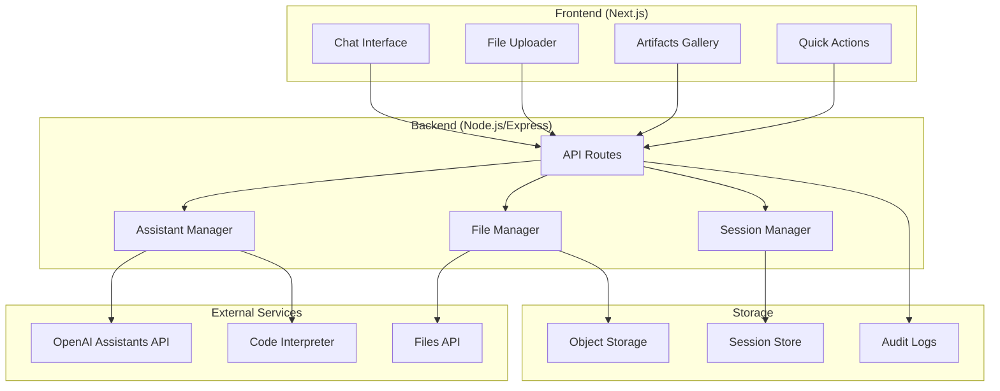

# Design Document

## Overview

The AI Data Analyst Demo is a full-stack web application that provides automated data analysis capabilities through OpenAI's Assistants API. The system consists of a Next.js frontend with chat interface and file upload capabilities, and a Node.js backend that orchestrates interactions with OpenAI's services including the Assistants API, Code Interpreter, and Files API.

The architecture follows a clean separation between presentation, business logic, and external service integration, with emphasis on real-time user feedback, artifact management, and graceful error handling.

## Architecture

### High-Level Architecture



### Component Architecture

**Frontend Components (MUI-based):**

- `AnalystMuiScaffold`: Main layout component with AppBar, Drawer, and responsive design
- `ChatPane`: Conversation UI with message history and input using MUI TextField and IconButton
- `FileUploader`: Drag-and-drop CSV upload with MUI components and validation
- `ArtifactsPanel`: Right drawer showing generated files with MUI List and download buttons
- `QuickActions`: Preset analysis buttons using MUI Button components with icons
- `ChatMessage`: Individual message display with MUI Box and Typography
- `ThemeToggle`: Dark/light mode toggle using MUI IconButton
- `InsightCard`: Structured display of analysis results using MUI Card components
- `ErrorBoundary`: Graceful error handling with MUI Alert and Snackbar components

**Backend Services (In-Memory MVP):**

- `AssistantService`: Manages OpenAI Assistant lifecycle and conversations
- `FileService`: Handles file upload, validation, and temporary storage
- `AnalysisService`: Orchestrates data analysis workflows
- `SessionStore`: In-memory session management with TTL cleanup
- `FileStore`: Temporary file storage in filesystem
- `PIIFilter`: Detects and flags PII columns in uploaded data
- `RunQueue`: Simple in-memory queue for managing concurrent analyses

## Components and Interfaces

### Frontend Interfaces

```typescript
// Core data types
interface AnalysisResult {
  id: string;
  type: 'profile' | 'trend' | 'top-sku' | 'channel-mix' | 'outlier';
  insight: string;
  chartUrl?: string;
  dataUrl?: string;
  timestamp: Date;
}

interface ChatMessage {
  id: string;
  role: 'user' | 'assistant' | 'system';
  content: string;
  artifacts?: AnalysisResult[];
  timestamp: Date;
}

interface FileUploadResult {
  fileId: string;
  filename: string;
  size: number;
  rowCount: number;
  profile: DataProfile;
}

interface DataProfile {
  rowCount: number;
  columnCount: number;
  columns: ColumnInfo[];
  sampleRows: Record<string, any>[];
  missingData: Record<string, number>;
}

// MUI-specific component props
interface QuickActionsProps {
  onAction: (label: string) => void;
  disabled?: boolean;
}

interface ArtifactsPanelProps {
  items: ArtifactItem[];
  onDownload: (id: string) => void;
  onBulkExport: () => void;
}

interface ArtifactItem {
  id: string;
  name: string;
  kind: 'file' | 'image' | 'data';
  size?: number;
  downloadUrl: string;
}

interface ThemeMode {
  mode: 'light' | 'dark' | 'system';
  setMode: (mode: 'light' | 'dark' | 'system') => void;
  effectiveDark: boolean;
}
```

### Backend API Endpoints (Next.js App Router)

```typescript
// Next.js API routes in app/api/
POST /api/files/upload
  - Handles CSV file upload and validation
  - Returns: FileUploadResult

POST /api/analysis/profile
  - Triggers data profiling analysis
  - Body: { fileId: string }
  - Returns: AnalysisResult

POST /api/analysis/query
  - Executes specific analysis query (used by QuickActions)
  - Body: { fileId: string, query: string, threadId?: string }
  - Returns: AnalysisResult

GET /api/analysis/suggestions
  - Gets suggested analysis questions
  - Query: fileId
  - Returns: string[]

POST /api/export/artifacts
  - Exports analysis artifacts (bulk export functionality)
  - Body: { threadId: string, artifactIds: string[] }
  - Returns: { downloadUrl: string }

GET /api/sessions/:threadId
  - Retrieves session state and message history
  - Returns: { messages: ChatMessage[], artifacts: AnalysisResult[] }

GET /api/artifacts/:id/download
  - Downloads individual artifact files via signed URLs
  - Returns: File stream with proper headers and MIME type validation

POST /api/files/delete
  - Immediate purge of user data (GDPR compliance)
  - Body: { sessionId: string }
  - Returns: { deleted: boolean }

// Enhanced streaming and run management
GET /api/runs/:threadId/stream
  - Server-sent events for real-time analysis progress
  - Returns: EventSource stream with RunEvent types

POST /api/runs/:threadId/cancel
  - Cancel an in-flight analysis run (idempotent)
  - Returns: { cancelled: boolean }

// Enhanced headers support
POST /api/analysis/query
  - Supports Idempotency-Key header to prevent duplicate runs
  - Returns HTTP 429 with Retry-After for queue backpressure
```

### OpenAI Integration Layer (Simplified)

```typescript
interface AssistantManager {
  // One-time setup
  createAssistant(): Promise<{ id: string }>;

  // Per session
  createThread(): Promise<{ id: string }>;

  // Per analysis
  createMessage(
    threadId: string,
    content: string,
    fileId?: string
  ): Promise<void>;
  createRun(
    threadId: string,
    assistantId: string,
    stream?: boolean
  ): Promise<Run>;
  cancelRun(threadId: string, runId: string): Promise<void>;

  // Results
  getMessages(threadId: string, runId?: string): Promise<Message[]>;
  downloadFile(fileId: string): Promise<Buffer>;
}

// Simplified run creation
interface CreateRunParams {
  assistant_id: string;
  stream?: boolean;
  max_prompt_tokens?: number;
  max_completion_tokens?: number;
  tool_choice?: 'auto' | 'required';
}

// Key streaming events to handle
type StreamEvent =
  | { event: 'thread.run.created'; data: Run }
  | { event: 'thread.run.queued'; data: Run }
  | { event: 'thread.run.in_progress'; data: Run }
  | { event: 'thread.run.completed'; data: Run }
  | { event: 'thread.run.failed'; data: Run }
  | { event: 'thread.message.created'; data: Message }
  | { event: 'thread.message.delta'; data: MessageDelta }
  | { event: 'thread.message.completed'; data: Message };

type RunEvent =
  | { type: 'run.started'; runId: string }
  | { type: 'run.step'; runId: string; step: string; detail?: any }
  | {
      type: 'artifact.created';
      runId: string;
      messageId: string;
      artifact: ArtifactRef;
    }
  | { type: 'run.completed'; runId: string }
  | {
      type: 'run.failed';
      runId: string;
      error: { code: string; message: string };
    };

interface ArtifactRef {
  id: string;
  kind: 'image' | 'file';
  filename: string;
  openaiFileId: string;
}

interface Artifact {
  type: 'image' | 'file';
  filename: string;
  content: Buffer;
  mimeType: string;
}

// Run Orchestrator for managing analysis execution
interface RunOrchestrator {
  queueAnalysis(
    request: AnalysisRequest
  ): Promise<{ runId: string; queuePosition?: number }>;
  checkBudget(
    sessionId: string
  ): Promise<{ allowed: boolean; remaining: number }>;
  retryFailedRun(runId: string): Promise<void>;
  streamRunEvents(runId: string): AsyncIterable<RunEvent>;
  cancelRun(runId: string): Promise<void>;
}

// PII Filter for data privacy
interface PIIFilter {
  scanColumns(data: any[]): Promise<PIIFlags>;
  redactPII(data: any[], flags: PIIFlags): any[];
}

interface PIIFlags {
  [columnName: string]: {
    isPII: boolean;
    confidence: number;
    type: 'email' | 'phone' | 'name' | 'address' | 'other';
  };
}
```

## Data Models

### Storage Options

**Option 1: In-Memory (Recommended for MVP Demo)**

- Sessions stored in Map/WeakMap with automatic cleanup
- File metadata cached in memory during session
- Artifacts stored temporarily in filesystem with cleanup
- No database setup required
- Perfect for demo/prototype scenarios
- Automatic cleanup on server restart

**Option 2: Database (Production)**

- Persistent storage for multi-user scenarios
- Audit logging and compliance features
- Session recovery across server restarts

### In-Memory Data Structures (MVP Approach)

```typescript
// In-memory session management
class SessionStore {
  private sessions = new Map<string, SessionData>();
  private readonly TTL = 2 * 60 * 60 * 1000; // 2 hours

  constructor() {
    // Cleanup expired sessions every 30 minutes
    setInterval(() => this.cleanup(), 30 * 60 * 1000);
  }

  set(sessionId: string, data: SessionData) {
    this.sessions.set(sessionId, {
      ...data,
      lastActivity: Date.now(),
      expiresAt: Date.now() + this.TTL,
    });
  }

  get(sessionId: string): SessionData | null {
    const session = this.sessions.get(sessionId);
    if (!session || session.expiresAt < Date.now()) {
      this.sessions.delete(sessionId);
      return null;
    }
    return session;
  }

  private cleanup() {
    const now = Date.now();
    for (const [id, session] of this.sessions) {
      if (session.expiresAt < now) {
        this.sessions.delete(id);
      }
    }
  }
}

interface SessionData {
  threadId: string;
  messages: ChatMessage[];
  artifacts: ArtifactItem[];
  uploadedFile?: FileMetadata;
  lastActivity: number;
  expiresAt: number;
}

interface FileMetadata {
  id: string;
  filename: string;
  size: number;
  checksum: string;
  openaiFileId: string;
  profile?: DataProfile;
  piiFlags?: PIIFlags;
}

// Simple file storage in temp directory
class FileStore {
  private readonly baseDir = '/tmp/analyst-demo';

  async storeArtifact(
    sessionId: string,
    filename: string,
    content: Buffer
  ): Promise<string> {
    const sessionDir = path.join(this.baseDir, sessionId);
    await fs.mkdir(sessionDir, { recursive: true });

    const filePath = path.join(sessionDir, filename);
    await fs.writeFile(filePath, content);

    return filePath;
  }

  async getArtifact(sessionId: string, filename: string): Promise<Buffer> {
    const filePath = path.join(this.baseDir, sessionId, filename);
    return fs.readFile(filePath);
  }

  async cleanup(sessionId: string) {
    const sessionDir = path.join(this.baseDir, sessionId);
    await fs.rm(sessionDir, { recursive: true, force: true });
  }
}
```

## Error Handling

### Error Categories and Responses

```typescript
enum ErrorType {
  USER_ERROR = 'user_error',
  SYSTEM_ERROR = 'system_error',
  TIMEOUT_ERROR = 'timeout_error',
  VALIDATION_ERROR = 'validation_error',
  API_ERROR = 'api_error',
  QUEUE_LIMIT_REACHED = 'queue_limit_reached',
}

interface ErrorResponse {
  type: ErrorType;
  message: string;
  details?: any;
  suggestedAction?: string;
  retryable: boolean;
}

// Enhanced error handling with OpenAI-specific mappings
const errorHandlers = {
  fileValidation: (error: ValidationError) => ({
    type: ErrorType.VALIDATION_ERROR,
    message: 'Please upload a valid CSV file under 50MB',
    suggestedAction: 'Check file format and size',
    retryable: true,
  }),

  queueLimitReached: () => ({
    type: ErrorType.QUEUE_LIMIT_REACHED,
    message:
      "Too many concurrent analyses. You're queued—this will start automatically.",
    suggestedAction: 'Wait for your turn or cancel other running analyses',
    retryable: false,
  }),

  openaiInsufficientQuota: (error: OpenAIError) => ({
    type: ErrorType.API_ERROR,
    message: 'OpenAI quota exceeded. Please try again later.',
    suggestedAction: 'Contact support if this persists',
    retryable: false,
  }),

  openaiRateLimit: (error: OpenAIError) => ({
    type: ErrorType.API_ERROR,
    message: 'Rate limit exceeded. Please wait before retrying.',
    suggestedAction: 'Wait and try again',
    retryable: true,
  }),

  openaiTimeout: (error: TimeoutError) => ({
    type: ErrorType.TIMEOUT_ERROR,
    message: 'Analysis sandbox timed out',
    suggestedAction: 'Try with a smaller dataset or simpler query',
    retryable: true,
  }),

  missingColumns: (error: SchemaError) => ({
    type: ErrorType.USER_ERROR,
    message: `Required columns missing: ${error.missingColumns.join(', ')}`,
    suggestedAction: 'Use column mapping to identify the correct fields',
    retryable: true,
  }),
};
```

### Retry Logic

```typescript
class RetryableOperation {
  async executeWithRetry<T>(
    operation: () => Promise<T>,
    maxRetries: number = 3,
    backoffMs: number = 1000
  ): Promise<T> {
    for (let attempt = 1; attempt <= maxRetries; attempt++) {
      try {
        return await operation();
      } catch (error) {
        if (attempt === maxRetries || !this.isRetryable(error)) {
          throw error;
        }
        await this.delay(backoffMs * Math.pow(2, attempt - 1));
      }
    }
    throw new Error('Max retries exceeded');
  }
}
```

## Implementation Assets

### OpenAI Assistant System Prompt

```
You are "Analyst-in-a-Box", a careful data analyst.

Contract:
1) When a CSV is provided, first PROFILE the dataset:
   - rows, columns, dtypes, missing %, 5 sample rows (as a markdown table).
   - Detect likely PII columns (email/phone) and set pii=true/false per column.

2) Then PROPOSE 3–5 concrete analyses tailored to available columns.
   - Mark each suggestion with required columns.

3) When the user picks one, RUN exactly one analysis and produce:
   - A 2–3 line plain-English INSIGHT.
   - A single matplotlib PNG chart saved as /mnt/data/plot.png (readable axes, title, units).
   - If you transform data, save /mnt/data/cleaned.csv.

4) Always print a SINGLE LINE of JSON to stdout as the last line:
   {"manifest":{
      "insight":"...",
      "files":[
        {"path":"/mnt/data/plot.png","type":"image","purpose":"chart"},
        {"path":"/mnt/data/cleaned.csv","type":"file","purpose":"data"}
      ],
      "metadata":{"analysis_type":"trend|top-sku|profile|channel-mix","columns_used":["..."]}
   }}

Rules:
- If the request exceeds MVP scope (multi-segmentation), pick the first segment and state the limitation.
- If required columns are missing, STOP and ask for column mapping.
- Use safe defaults: ISO date parsing, currency formatting, thousands separators.
- Never display raw PII values; aggregate or redact.
```

### Simplified OpenAI Integration (Golden Path)

```typescript
// Assistant Creation (One-time Setup)
const assistant = await openai.beta.assistants.create({
  name: 'Analyst-in-a-Box',
  model: 'gpt-4o',
  tools: [{ type: 'code_interpreter' }],
  instructions: `[System prompt above]`,
  temperature: 0.2,
});

// Session Workflow (Per User)
// 1. Create thread
const thread = await openai.beta.threads.create();

// 2. Add message with CSV attachment
await openai.beta.threads.messages.create(thread.id, {
  role: 'user',
  content: 'Profile the file and suggest questions.',
  attachments: [
    {
      file_id: csvFileId,
      tools: [{ type: 'code_interpreter' }],
    },
  ],
});

// 3. Create streaming run
const run = await openai.beta.threads.runs.create(thread.id, {
  assistant_id: assistant.id,
  stream: true,
  max_prompt_tokens: 1000,
  max_completion_tokens: 1000,
});
```

### Server-Sent Events Implementation

```typescript
// app/api/runs/[threadId]/stream/route.ts
export async function GET(
  request: NextRequest,
  { params }: { params: { threadId: string } }
) {
  const stream = new ReadableStream({
    start(controller) {
      const encoder = new TextEncoder();

      const send = (event: any) => {
        controller.enqueue(
          encoder.encode(`data: ${JSON.stringify(event)}\n\n`)
        );
      };

      // Handle key OpenAI stream events
      const handleStreamEvent = (event: any) => {
        switch (event.event) {
          case 'thread.run.created':
          case 'thread.run.queued':
          case 'thread.run.in_progress':
            send({ type: 'run.status', status: event.data.status });
            break;

          case 'thread.run.completed':
            send({ type: 'run.completed', runId: event.data.id });
            fetchAndSendArtifacts(event.data.thread_id, event.data.id);
            break;

          case 'thread.run.failed':
            send({ type: 'run.failed', error: event.data.last_error });
            break;
        }
      };

      streamOpenAIRun(params.threadId, handleStreamEvent);
    },
  });

  return new Response(stream, {
    headers: {
      'Content-Type': 'text/event-stream',
      'Cache-Control': 'no-cache',
      Connection: 'keep-alive',
    },
  });
}
```

## Security Enhancements

### Content Security Policy

```typescript
// next.config.js
const nextConfig = {
  async headers() {
    return [
      {
        source: '/(.*)',
        headers: [
          {
            key: 'Content-Security-Policy',
            value:
              "default-src 'self'; script-src 'self' 'unsafe-eval'; style-src 'self' 'unsafe-inline'; img-src 'self' data: blob:; connect-src 'self' https://api.openai.com;",
          },
        ],
      },
    ];
  },
};
```

### File Validation and Checksums

```typescript
export function validateCSVFile(buffer: Buffer, filename: string) {
  const mimeType = getMimeType(buffer);
  if (mimeType !== 'text/csv' && mimeType !== 'text/plain') {
    throw new ValidationError('File must be CSV format');
  }

  const checksum = crypto.createHash('sha256').update(buffer).digest('hex');

  if (buffer.length > 50 * 1024 * 1024) {
    throw new ValidationError('File size exceeds 50MB limit');
  }

  return { checksum, mimeType };
}
```
