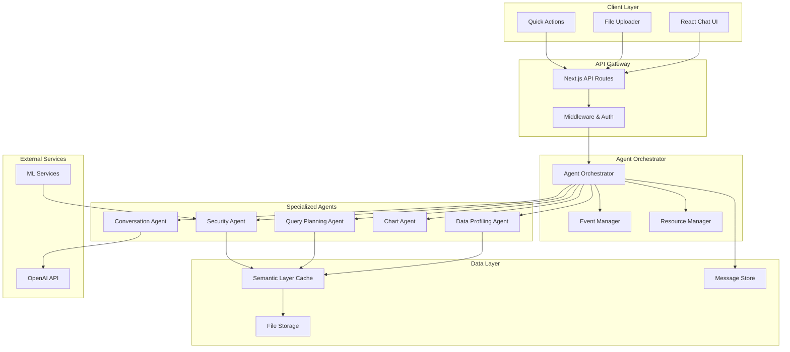

# Semantic Layer Design Document

## Architecture Overview

The Multi-Agent Semantic Data Layer replaces direct LLM CSV processing with a coordinated system of specialized agents. Each agent handles a specific domain while maintaining clear interfaces for composition and orchestration.

## System Architecture



## Agent Specifications

### 1. Data Profiling Agent

**Purpose**: Analyze CSV structure, quality, and characteristics upon upload

**Interface**:

```typescript
interface DataProfilingAgent {
  analyze(csvBuffer: Buffer, filename: string): Promise<DataProfile>;
  validateSchema(
    profile: DataProfile,
    requirements: SchemaRequirements
  ): ValidationResult;
  suggestAnalyses(profile: DataProfile): AnalysisSuggestion[];
}

interface DataProfile {
  metadata: {
    filename: string;
    size: number;
    encoding: string;
    delimiter: string;
    rowCount: number;
    columnCount: number;
    processingTime: number;
  };
  schema: {
    columns: ColumnProfile[];
    primaryKey?: string;
    foreignKeys: string[];
  };
  quality: QualityMetrics;
  security: SecurityProfile;
  insights: DataInsights;
  recommendations: string[];
}

interface ColumnProfile {
  name: string;
  type: 'numeric' | 'categorical' | 'datetime' | 'text' | 'boolean';
  nullable: boolean;
  unique: boolean;

  // Statistics based on type
  statistics: NumericStats | CategoricalStats | DateTimeStats | TextStats;

  // Quality metrics
  nullCount: number;
  nullPercentage: number;
  uniqueCount: number;
  duplicateCount: number;

  // Sample data (anonymized)
  sampleValues: any[];

  // Data quality flags
  qualityFlags: QualityFlag[];
}
```

**Core Logic**:

1. **Stream Processing**: Use csv-parser for memory-efficient processing of large files
2. **Type Inference**: Analyze sample data to determine column types with confidence scores
3. **Statistical Analysis**: Compute descriptive statistics appropriate for each data type
4. **Quality Assessment**: Identify data quality issues (nulls, duplicates, outliers, inconsistencies)
5. **Smart Sampling**: Generate representative samples for visualization and analysis

**Performance Target**: <2 seconds for 100MB files

### 2. Query Planning Agent

**Purpose**: Parse natural language queries and generate optimized execution plans

**Interface**:

```typescript
interface QueryPlanningAgent {
  parseIntent(query: string, profile: DataProfile): QueryIntent;
  generatePlan(intent: QueryIntent, profile: DataProfile): ExecutionPlan;
  optimizePlan(plan: ExecutionPlan): OptimizedPlan;
  estimateCost(plan: OptimizedPlan): CostEstimate;
}

interface QueryIntent {
  type:
    | 'profile'
    | 'trend'
    | 'comparison'
    | 'aggregation'
    | 'filter'
    | 'custom';
  entities: {
    measures: string[]; // Revenue, quantity, etc.
    dimensions: string[]; // Time, category, region, etc.
    filters: FilterCondition[];
    timeframe?: TimeRange;
  };
  operation: {
    groupBy: string[];
    aggregation: 'sum' | 'avg' | 'count' | 'min' | 'max';
    sort: { column: string; direction: 'asc' | 'desc' }[];
    limit?: number;
  };
  visualization?: {
    type: 'bar' | 'line' | 'pie' | 'scatter' | 'table';
    x_axis?: string;
    y_axis?: string;
  };
}

interface ExecutionPlan {
  steps: PlanStep[];
  estimatedTime: number;
  cacheKey?: string;
  fallbackToLLM: boolean;
}
```

**Core Logic**:

1. **Intent Classification**: Use pattern matching and simple ML to classify query types
2. **Entity Extraction**: Identify measures, dimensions, and filters from natural language
3. **Plan Generation**: Create step-by-step execution plan using data profile
4. **Optimization**: Apply query optimization techniques (predicate pushdown, early aggregation)
5. **Caching Strategy**: Generate cache keys for reusable query patterns

**Fallback Strategy**: Complex queries that can't be parsed automatically fall back to LLM processing

### 3. Security Agent

**Purpose**: Detect and protect PII throughout the data pipeline

**Interface**:

```typescript
interface SecurityAgent {
  scanPII(profile: DataProfile): PIIReport;
  redactData(data: any[], piiColumns: string[]): RedactedData;
  validateSafeOutput(content: string): SecurityValidation;
  auditAccess(operation: DataOperation, user: UserContext): void;
}

interface PIIReport {
  piiColumns: PIIColumn[];
  riskLevel: 'low' | 'medium' | 'high' | 'critical';
  recommendations: SecurityRecommendation[];
  complianceFlags: ComplianceFlag[];
}

interface PIIColumn {
  name: string;
  type:
    | 'email'
    | 'phone'
    | 'name'
    | 'address'
    | 'ssn'
    | 'credit_card'
    | 'other';
  confidence: number;
  detectionMethod: 'pattern' | 'column_name' | 'ml_classifier';
  sampleMatches: string[];
  recommendations: string[];
}
```

**Core Logic**:

1. **Multi-Layer Detection**: Column names, regex patterns, ML classification
2. **Context-Aware Analysis**: Consider data relationships and business context
3. **Confidence Scoring**: Probabilistic assessment of PII likelihood
4. **Automatic Redaction**: Replace PII with semantic placeholders
5. **Audit Logging**: Track all data access for compliance

**Compliance Features**: GDPR, CCPA, HIPAA consideration in redaction strategies

### 4. Chart Generation Agent

**Purpose**: Create optimized visualizations based on data characteristics

**Interface**:

```typescript
interface ChartAgent {
  recommendChartType(
    data: AnalysisResult,
    intent: QueryIntent
  ): ChartRecommendation;
  generateChart(data: AnalysisResult, config: ChartConfig): ChartOutput;
  optimizeForAccessibility(chart: ChartOutput): ChartOutput;
}

interface ChartRecommendation {
  type: ChartType;
  confidence: number;
  reasoning: string;
  alternatives: Array<{ type: ChartType; score: number }>;
}

interface ChartConfig {
  type: ChartType;
  title: string;
  xAxis: AxisConfig;
  yAxis: AxisConfig;
  data: DataPoint[];
  styling: ChartStyling;
  accessibility: AccessibilityConfig;
}
```

**Core Logic**:

1. **Smart Chart Selection**: Choose optimal chart type based on data characteristics
2. **Professional Styling**: Consistent, accessible design system
3. **Data Optimization**: Handle large datasets with intelligent sampling/binning
4. **Responsive Design**: Charts that work across devices
5. **Accessibility**: Alt text, color contrast, keyboard navigation

### 5. Conversation Agent

**Purpose**: Handle complex reasoning and natural language interaction

**Interface**:

```typescript
interface ConversationAgent {
  generateInsight(
    analysisResult: AnalysisResult,
    context: ConversationContext
  ): string;
  answerFollowUp(question: string, context: ConversationContext): Response;
  suggestNextQuestions(context: ConversationContext): string[];
}

interface ConversationContext {
  dataProfile: DataProfile;
  analysisHistory: AnalysisResult[];
  currentInsight: string;
  userPreferences: UserPreferences;
}
```

**Core Logic**:

1. **Context Management**: Maintain conversation state across interactions
2. **Insight Generation**: Transform analysis results into natural language insights
3. **Follow-up Handling**: Answer questions about previous analyses
4. **Smart Suggestions**: Recommend relevant next steps based on context

## Data Models

### Core Data Structures

```typescript
// Enhanced from PRD with implementation details
interface DataProfile {
  id: string;
  version: number;
  createdAt: Date;
  expiresAt: Date;

  metadata: FileMetadata;
  schema: SchemaProfile;
  quality: QualityMetrics;
  security: SecurityProfile;
  insights: DataInsights;

  // Performance optimizations
  sampleData: SampleDataSet;
  aggregations: PrecomputedAggregations;
  indexes: DataIndexes;
}

interface QualityMetrics {
  overall: number; // 0-100 score
  dimensions: {
    completeness: number; // % non-null values
    consistency: number; // Data format consistency
    accuracy: number; // Estimated accuracy score
    uniqueness: number; // Duplicate detection
    validity: number; // Constraint compliance
  };
  issues: QualityIssue[];
}

interface PrecomputedAggregations {
  numeric: {
    [column: string]: {
      sum: number;
      avg: number;
      min: number;
      max: number;
      stddev: number;
      percentiles: number[];
      histogram: HistogramBin[];
    };
  };
  categorical: {
    [column: string]: {
      valuecounts: Record<string, number>;
      topValues: Array<{ value: string; count: number }>;
      uniqueCount: number;
    };
  };
  temporal: {
    [column: string]: {
      range: { start: Date; end: Date };
      frequency: 'daily' | 'weekly' | 'monthly' | 'yearly';
      trend: 'increasing' | 'decreasing' | 'stable' | 'seasonal';
      seasonality?: SeasonalityPattern;
    };
  };
}
```

## Agent Communication Protocol

### Message Passing Architecture

```typescript
interface AgentMessage {
  id: string;
  from: AgentType;
  to: AgentType | 'orchestrator';
  type: MessageType;
  payload: any;
  timestamp: Date;
  correlationId: string;
}

enum MessageType {
  REQUEST = 'request',
  RESPONSE = 'response',
  ERROR = 'error',
  NOTIFICATION = 'notification',
  HEARTBEAT = 'heartbeat',
}

interface AgentOrchestrator {
  // Core orchestration methods
  processDataUpload(file: UploadedFile): Promise<DataProfile>;
  executeQuery(query: string, profileId: string): Promise<AnalysisResult>;

  // Agent lifecycle management
  registerAgent(agent: Agent): void;
  routeMessage(message: AgentMessage): Promise<void>;
  handleAgentFailure(agentId: string, error: Error): Promise<void>;

  // Resource management
  checkResourceLimits(): ResourceStatus;
  balanceLoad(): Promise<void>;
}
```

### Workflow Orchestration

**Data Upload Workflow**:

```typescript
async processDataUpload(file: UploadedFile): Promise<DataProfile> {
  // 1. Initial validation
  this.validateFile(file);

  // 2. Parallel agent processing
  const [profile, securityReport] = await Promise.all([
    this.profilingAgent.analyze(file.buffer, file.name),
    this.securityAgent.scanPII(file.buffer)
  ]);

  // 3. Merge results and cache
  const enrichedProfile = this.mergeProfiles(profile, securityReport);
  await this.semanticCache.store(enrichedProfile);

  // 4. Generate suggestions
  const suggestions = await this.profilingAgent.suggestAnalyses(enrichedProfile);

  return { ...enrichedProfile, suggestions };
}
```

**Query Execution Workflow**:

```typescript
async executeQuery(query: string, profileId: string): Promise<AnalysisResult> {
  // 1. Load cached profile
  const profile = await this.semanticCache.get(profileId);

  // 2. Parse query intent
  const intent = await this.queryAgent.parseIntent(query, profile);

  // 3. Check cache for similar queries
  const cacheKey = this.generateCacheKey(intent, profileId);
  const cached = await this.semanticCache.getAnalysis(cacheKey);
  if (cached) return cached;

  // 4. Generate execution plan
  const plan = await this.queryAgent.generatePlan(intent, profile);

  // 5. Route to appropriate execution path
  let result: AnalysisResult;
  if (plan.fallbackToLLM) {
    // Complex reasoning requires LLM
    result = await this.conversationAgent.processComplexQuery(query, profile);
  } else {
    // Can be handled by semantic layer
    result = await this.executeSemanticQuery(plan, profile);
  }

  // 6. Generate visualization if needed
  if (intent.visualization) {
    result.chart = await this.chartAgent.generateChart(result, intent.visualization);
  }

  // 7. Cache result and return
  await this.semanticCache.storeAnalysis(cacheKey, result);
  return result;
}
```

## Caching Strategy

### Multi-Level Caching Architecture

```typescript
interface SemanticCache {
  // Profile caching (24h TTL)
  storeProfile(profile: DataProfile): Promise<void>;
  getProfile(profileId: string): Promise<DataProfile | null>;

  // Query result caching (1h TTL for most queries)
  storeAnalysis(cacheKey: string, result: AnalysisResult): Promise<void>;
  getAnalysis(cacheKey: string): Promise<AnalysisResult | null>;

  // Aggregation caching (persistent until data changes)
  storeAggregation(key: string, aggregation: any): Promise<void>;
  getAggregation(key: string): Promise<any>;

  // Cache management
  invalidateProfile(profileId: string): Promise<void>;
  cleanup(): Promise<void>;
  getStats(): CacheStats;
}
```

**Cache Key Generation**:

```typescript
function generateCacheKey(intent: QueryIntent, profileId: string): string {
  const keyComponents = [
    profileId,
    intent.type,
    JSON.stringify(intent.entities),
    JSON.stringify(intent.operation),
  ];
  return crypto
    .createHash('sha256')
    .update(keyComponents.join('|'))
    .digest('hex');
}
```

## Integration Strategy

### Phase 1: Parallel Implementation

- Build semantic layer alongside existing system
- Use feature flags to control routing
- A/B testing framework for performance comparison
- Fallback to existing LLM path for unsupported queries

### Phase 2: Gradual Migration

- Route simple queries (profile, trends) to semantic layer
- Monitor performance and accuracy metrics
- Expand agent capabilities based on usage patterns
- Optimize hot paths identified through telemetry

### Phase 3: Full Integration

- Replace direct LLM processing for data operations
- Keep LLM for complex reasoning and natural language generation
- Implement advanced features (ML-based PII detection, query optimization)
- Scale agents based on load patterns

## Performance Optimization

### Streaming and Parallelization

```typescript
// Streaming CSV processing for large files
async processLargeCSV(csvStream: Readable): Promise<DataProfile> {
  const chunks = [];
  const statistics = new StreamingStatistics();

  return new Promise((resolve, reject) => {
    csvStream
      .pipe(csv())
      .on('data', (row) => {
        statistics.processRow(row);
        if (chunks.length < MAX_SAMPLE_SIZE) {
          chunks.push(row);
        }
      })
      .on('end', () => {
        const profile = statistics.generateProfile();
        profile.sampleData = chunks;
        resolve(profile);
      })
      .on('error', reject);
  });
}
```

### Memory Management

- Stream processing for files >100MB
- LRU eviction for cache management
- Worker threads for CPU-intensive analysis
- Memory monitoring and garbage collection optimization

## Error Handling and Resilience

### Agent Failure Handling

```typescript
class ResilientAgent {
  async execute<T>(
    operation: () => Promise<T>,
    fallback?: () => Promise<T>
  ): Promise<T> {
    try {
      return await this.withTimeout(operation(), 30000);
    } catch (error) {
      this.logger.error('Agent operation failed', {
        error,
        operation: operation.name,
      });

      if (fallback) {
        this.logger.info('Attempting fallback operation');
        return await fallback();
      }

      throw error;
    }
  }

  private async withTimeout<T>(
    promise: Promise<T>,
    timeoutMs: number
  ): Promise<T> {
    const timeout = new Promise<never>((_, reject) =>
      setTimeout(() => reject(new Error('Operation timeout')), timeoutMs)
    );

    return Promise.race([promise, timeout]);
  }
}
```

## Monitoring and Observability

### Agent Performance Metrics

```typescript
interface AgentMetrics {
  // Performance metrics
  executionTime: HistogramMetric;
  throughput: CounterMetric;
  errorRate: GaugeMetric;
  cacheHitRate: GaugeMetric;

  // Business metrics
  queriesProcessed: CounterMetric;
  filesAnalyzed: CounterMetric;
  piiDetected: CounterMetric;

  // Resource metrics
  memoryUsage: GaugeMetric;
  cpuUsage: GaugeMetric;
  queueDepth: GaugeMetric;
}
```

## Next Steps

1. **Technical Proof of Concept**: Build Data Profiling Agent MVP
2. **Performance Benchmarking**: Establish baseline metrics
3. **Integration Planning**: Define API contracts and migration strategy
4. **Testing Framework**: Create comprehensive test suite for agent interactions

---

**Document Status**: Design Phase Complete  
**Next Phase**: Task Breakdown and Sprint Planning  
**Last Updated**: September 29, 2025
